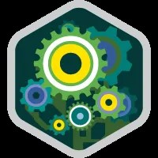

# 👋 **Hey, I'm Sudheesh Patwardhan!**  
### 🚀 *Innovative Developer | Web Tech Enthusiast | Problem Solver*

---

## 🌟 **About Me**  

Hi! I’m Sudheesh, a passionate developer dedicated to building impactful solutions. I specialize in **web development**, **machine learning**, and **security tools**, blending technology and creativity to tackle modern challenges.  

---

## 🔥 **What I Do**  

💻 **Web Development**  
- Developed **company portals**, **food delivery platforms**, and **temple websites** using **MERN Stack** & **PHP**.  

🕵️‍♂️ **Face Recognition**  
- Created a **high-accuracy face recognition system** with **OpenCV** and **ONNX models** for seamless verification.

🔍 **Network Security Tools**  
- Built **advanced network scanners** to strengthen data security and analysis capabilities.

🔐 **Encryption Systems**  
- Engineered **encryption tools** using robust multi-layered algorithms for secure text encoding.

---

## 💻 **Tech Stack**  

### 🌐 **Frontend Development**  
  
  
  
  

### 🛠️ **Backend Development**  
  
  
  

### 🗄️ **Databases**  
  
  

### 🤖 **Machine Learning**  
  
  

---

## 🌱 **What I’m Exploring**  

- **Advanced Web Development**: Enhancing my skills with cutting-edge **frontend** and **backend** technologies.  
- **Java Mastery**: Diving deeper into **enterprise-level development**.  

---

## 🏆 **Certifications & Achievements**  

🔑 *Salesforce Apex Specialist*  
  

---

## 🔗 **Connect with Me**  

  
  

---

✨ Check out my repositories or reach out—let’s collaborate to create something extraordinary! 🚀  
